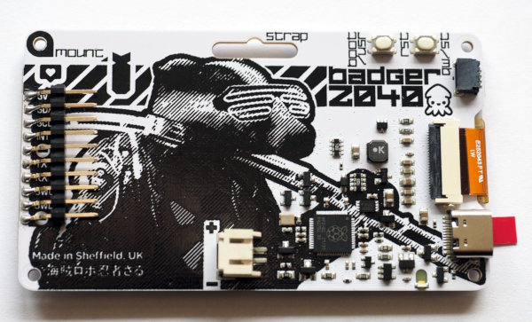
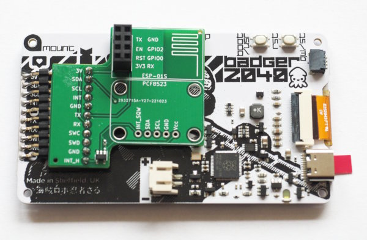
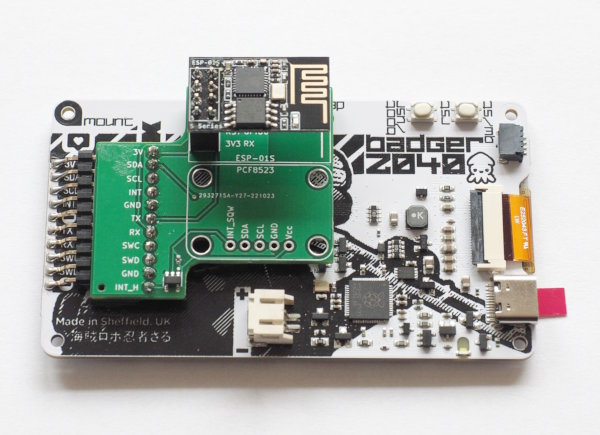
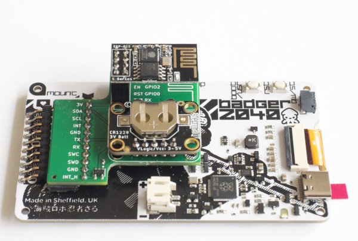

pcb-badger2040-wlan
===================

A small pcb that allows to add an ESP-01S and/or PCF8523-RTC-breakout
to the back of a Pimoroni Badger2040:

  - Badger2040 with SMD-pins:  
    

  - PCB added:  
    

  - ESP-01S connected:  
    

  - Additionally with RTC (PCF8523):  
    

Design-Files
------------

KiCAD source files are in `badger-2040-wlan.kicad`. Production files
for JLCPCB are in directory `production`.

Hack to wakeup the Badger2040 using the RTC
-------------------------------------------

If you don't use the ESP-01S, you can connect the
RTC-alarm pin to the INT-pin by closing the jumper on the
back. Note that wakeup will only work with battery if you
constantly hold one of the buttons pressed
(see <https://github.com/bablokb/badger2040-button-clamp>).

Also, wakup is currently not implemented in MicroPython.

License
-------

[![CC BY-SA 4.0][cc-by-sa-shield]][cc-by-sa]

This work is licensed under a
[Creative Commons Attribution-ShareAlike 4.0 International
License][cc-by-sa].

[![CC BY-SA 4.0][cc-by-sa-image]][cc-by-sa]

[cc-by-sa]: http://creativecommons.org/licenses/by-sa/4.0/
[cc-by-sa-image]: https://licensebuttons.net/l/by-sa/4.0/88x31.png
[cc-by-sa-shield]:
https://img.shields.io/badge/License-CC%20BY--SA%204.0-lightgrey.svg
