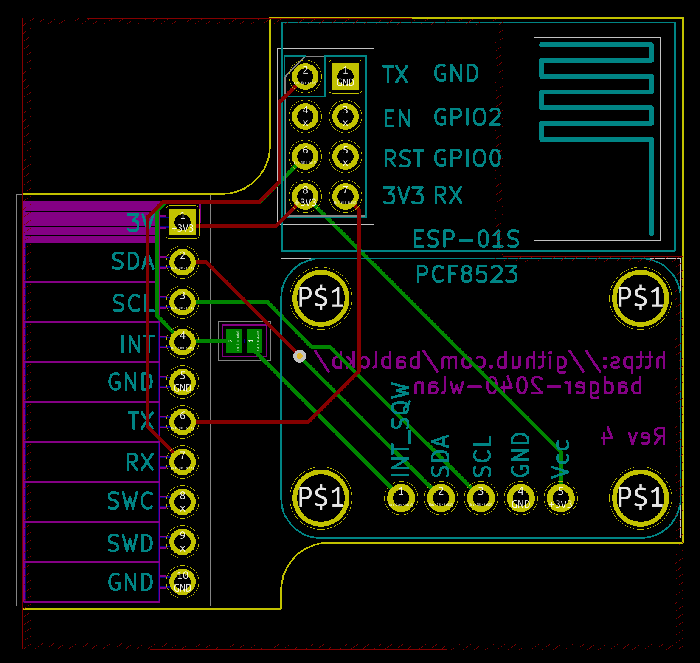
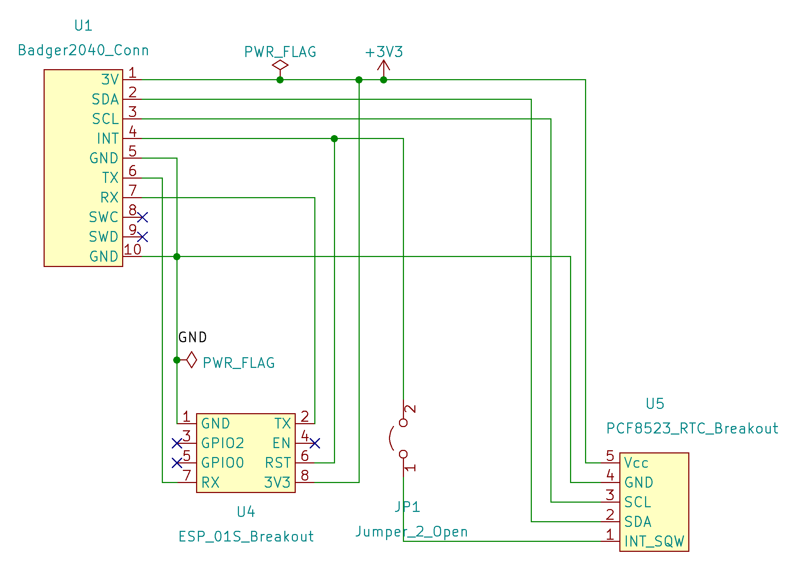

pcb-badger2040-wlan
===================

A small pcb that allows to add an ESP-01S and/or PCF8523-RTC-breakout
to the back of a Pimoroni Badger2040:

KiCAD source files are in `badger-2040-wlan.kicad`. Production files
for JLCPCB are in directory `production`. If you don't need the
wakeup-hack described below, it is sufficient to order only the
pcb without the SMT-assembly.

Hack to wakeup the Badger2040 using the RTC
-------------------------------------------

The RTC-alarm pin has a pullup and is connected using an inverter
to an additional pin. Note that the Badger2040 only has 10 pads!
This additional pin must be connected with a wire to one of the
buttons on the front. I have a wire going from the pin through
the mounting hole to the "down"-button. The button can still
be used normally.

If you don't use the ESP-01S, you can also connect the
RTC-alarm pin to the INT-pin by closing the jumper on the
back. Wakeup will then work if you constantly hold
one of the buttons pressed
(see <https://github.com/bablokb/badger2040-button-clamp>).

License
-------

[![CC BY-SA 4.0][cc-by-sa-shield]][cc-by-sa]

This work is licensed under a
[Creative Commons Attribution-ShareAlike 4.0 International
License][cc-by-sa].

[![CC BY-SA 4.0][cc-by-sa-image]][cc-by-sa]

[cc-by-sa]: http://creativecommons.org/licenses/by-sa/4.0/
[cc-by-sa-image]: https://licensebuttons.net/l/by-sa/4.0/88x31.png
[cc-by-sa-shield]:
https://img.shields.io/badge/License-CC%20BY--SA%204.0-lightgrey.svg
